## showArt

This is the final project for CS50’s Web Programming with Python and Javascript name showArt.
*showArt was created using mostly Django and React!

#### Distinctiveness
	
	Buying NFTs in the OpenSea website feels like buying a painting that you cannot take out of the store meaning that you cannot take your brand-new art home and display it in a way you would like making it plain and boring.

	showArt is then created to be a website, a home, for people who own NFTs to display it in a way that is more appealing than OpenSea. User can select how many owned NFTs they would like to be display, what NFTs they would like to display first, and even adding customisable backdrop (changing the backdrop colour or adding an image into the backdrop) to your NFTs. After that you can also view and visit other people’s gallery, and vote for the gallery you think is the most beautiful so that the gallery will be display in the Top 3 most voted page! 

#### Complexity

The complexity of the website lies in many places. 
	
	1. Getting the wallet address of a user who signed up with MetaMask wallet into the showArt website.
	
	2. Using the wallet address to fetch for all the user’s NFTs using OpenSea api with a recursion function. (OpenSea api limits only to 50 NFTs per query.)

	3. Sorting the data of each NFTs such as current owner, animation_url, image_url, and views to display it in showArt. 

	4. Making the create page as user friendly as possible because creating a NFTs gallery is something that most people might have never done. 
		
		1. Letting users add and delete backdrop (Creating new div size of width: 100% height: 100%) without refreshing by clicking a button.
		
		2. Changing the colour adding images as the background image of a backdrop without refreshing by clicking a button..
		
		3. Adding and deleting a smaller div class that contains a place to paste NFTs (name = ADDINGNFTS), input class for title of NFTs, and textarea class for description of NFTs without refreshing by clicking a button. 

		4. Making users easily click on any NFTs in the navigation bar in the create page and click on ADDINGNFTS in the backdrop to paste NFTs into the gallery.
	
	5. Saving all the data in the create page (All the backdrop with its changed background color or background images, all the NFTs, title, and description into one chunk of data into the database. 
	
	6. Creating an authenticity page where user can check whether an account still owns the NFTs that are displaying in the gallery or not. 

	7. On scroll css animation. (Used Animate.js)
	
	8. Background color of Title and Description of NFTs changing according to the average colour of the backdrop. (Used FastAverageColor.js)

	9. Read, write, and save profile picture and background image of a backdrop into the program. 

	10. Creating a rank system in the website where the top 3 most voted will be shown. 

	11. Search bar in the explore where the user can search for an account’s name without needing to refresh.

#### Files and Directories
*These are the files that I added or altered.

- `Main Directory`
	- `Galley` - Main application directory

		- `urls.py` - Contains all url paths for the whole showArt.
		- `views.py` - Contains all the view functions from urls.py and functions to send back response to the frontend javascript
		- `models.py` - Contains three classes Users, Wallet_Address, and Following
		
		- `src` - Contains all the raw javascript in react.
			- `authenticity.js` : contains javascript for checking whether an account owns the NFTs they are showing or not
			- `explore.js` :  contains javascript DOMContentLoaded to load main.js for explore and voted page
			- `gallery.js` : contains javascript to load and show top 3 page
			- `main.js`  :  contains javascript to search and display each gallery
			- `profile.js` : contains javascript to show profile, number of votes, and NFTs gallery
			- `realcreate.js` : contains javascript to create a gallery, fetch NFTs from opensea, and change background color of title according to the averaged backdrop’s background color
		
		- `static` - Contains all javascript in src that is rewritten, css, and folders that contains images.
		    - `main.css.` : css style for the about us page
            - `scroll.css` : css animation on scroll for the about us page
            - `style.css`: css style for the whole website
            - `rawfont.ttf`: downloaded font file
            - `profile_pic` : contain images of the user’s profile picture 
            - `shtfolder` : contain images that is used in the about us page.
		
		- `templates` - Contains all the html.
			- `connectwallet.html` : contains html of connect wallet page and also javascript to fetch the sign in user wallet address from MetaMask
            - `authenticity.html`  contains html for authenticity page and loading screen
            - `explore.html` : contains html for search bar, and all gallery
            - `index.html` : contains html for the about us page
            - `layout.html`: backbone of all the html, contains the navigation bar of the website
            - `login.html` : contains html for login 
            - `profile.html` : contains html for showing profile page and showing gallery	
            - `realcreate.html` : contains html for letting user select NFTs they want to display and the create gallery page
            - `register.html` : contains html for register

#### How does it work?

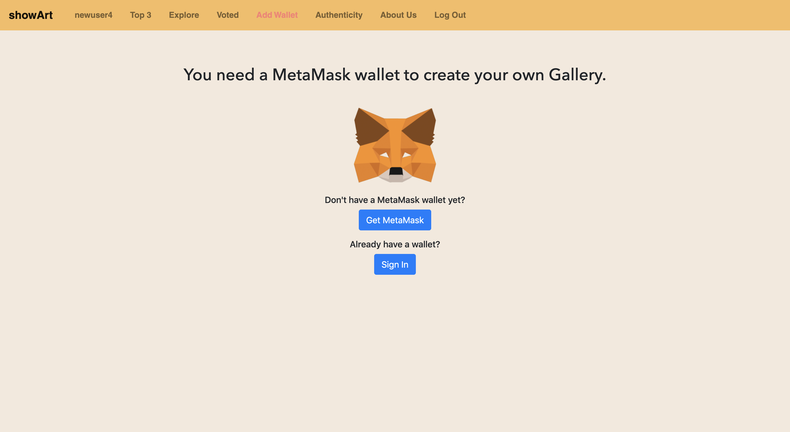
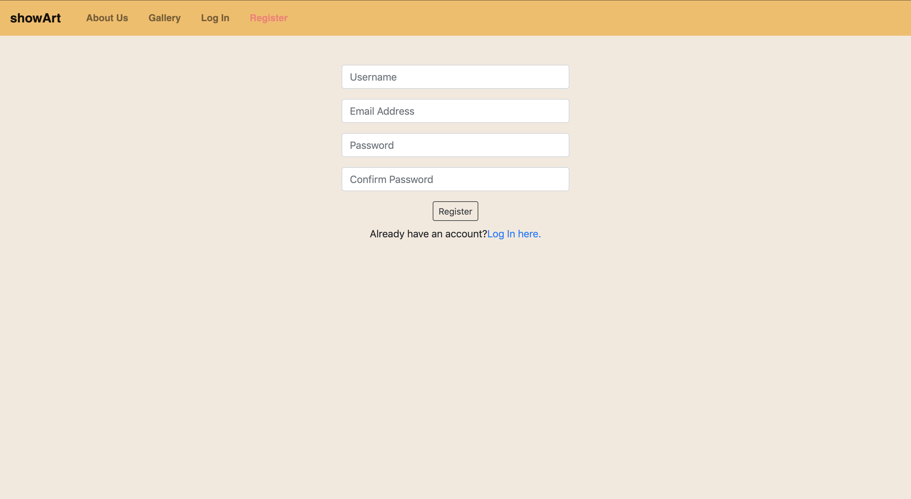

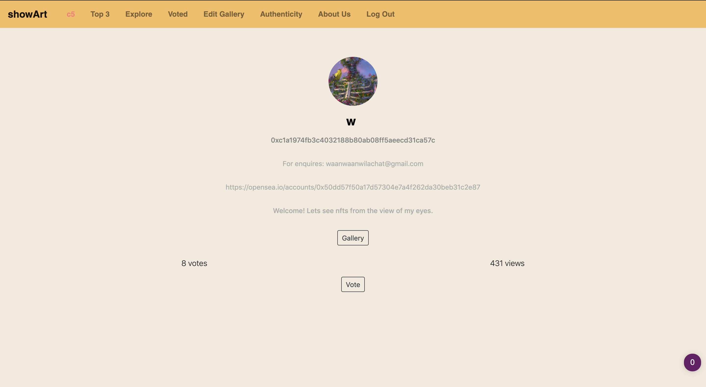
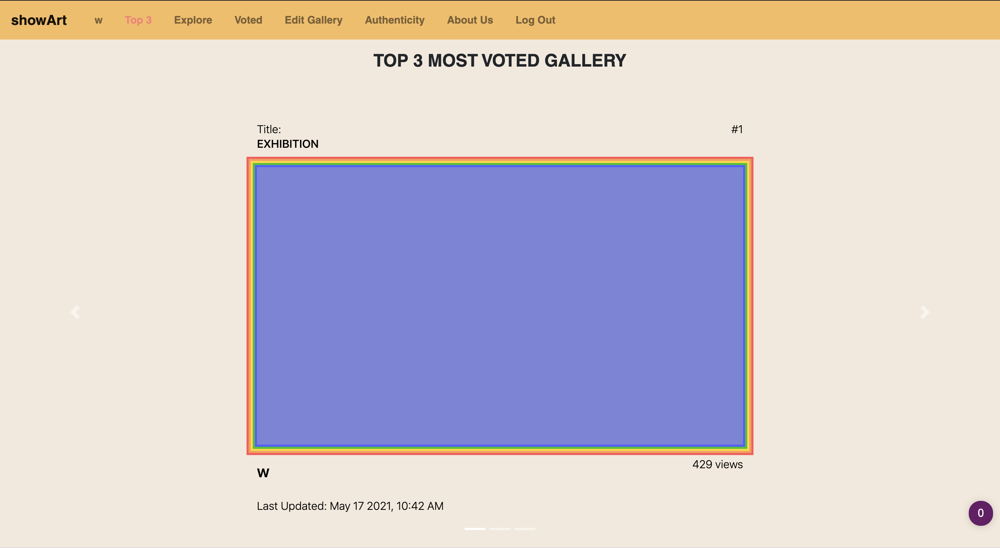
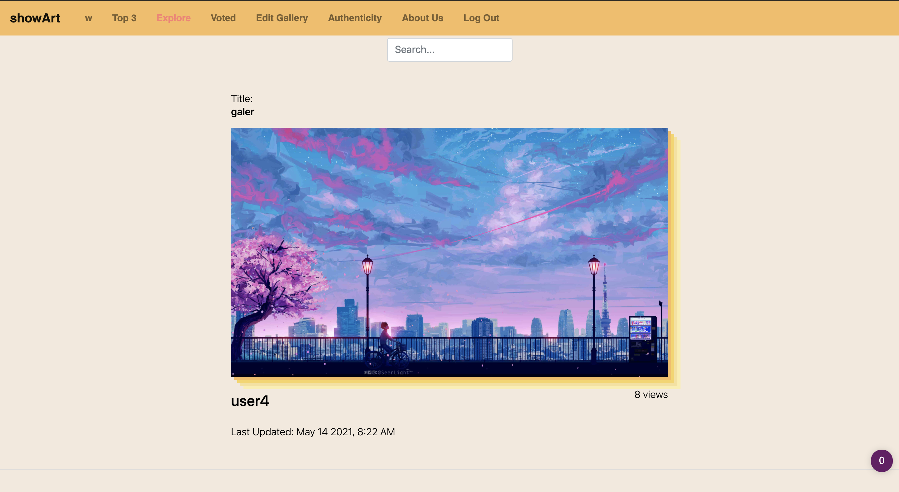
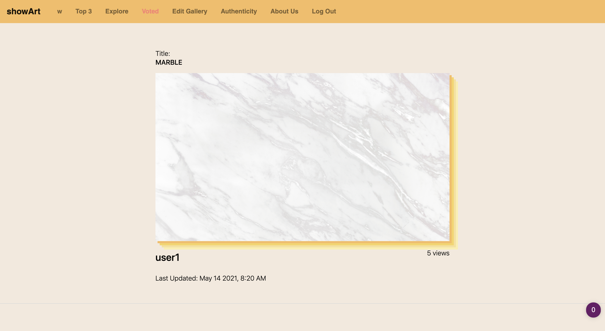
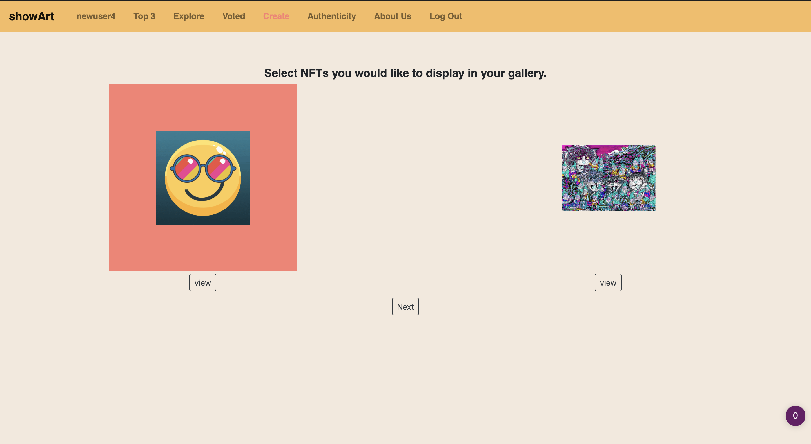

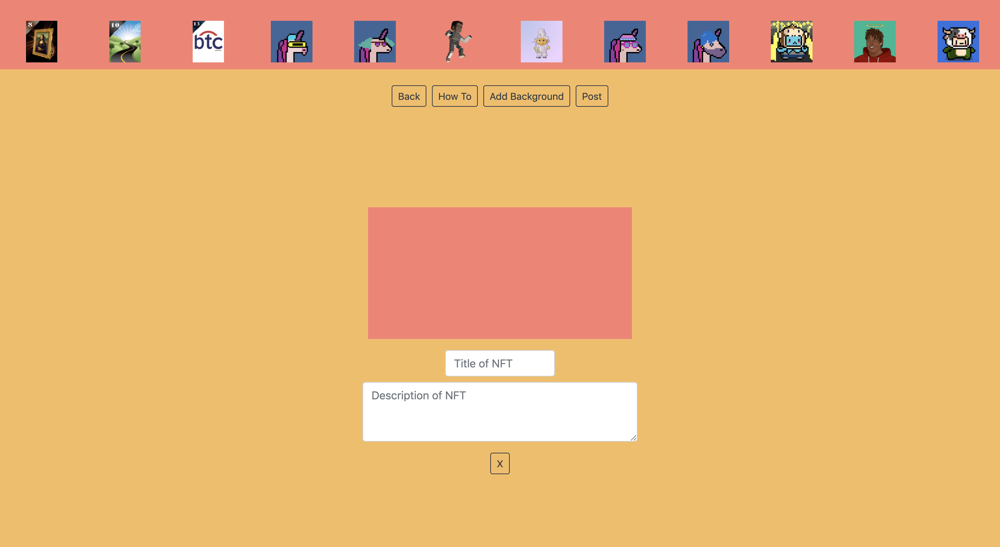
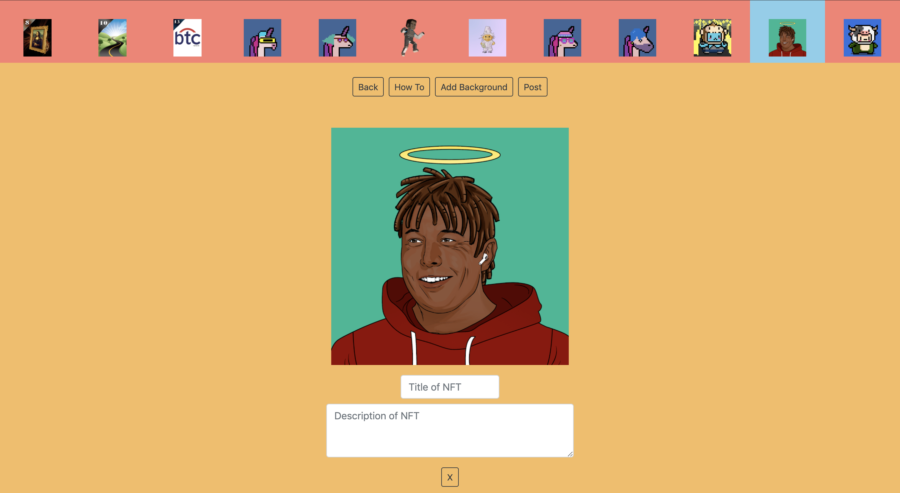
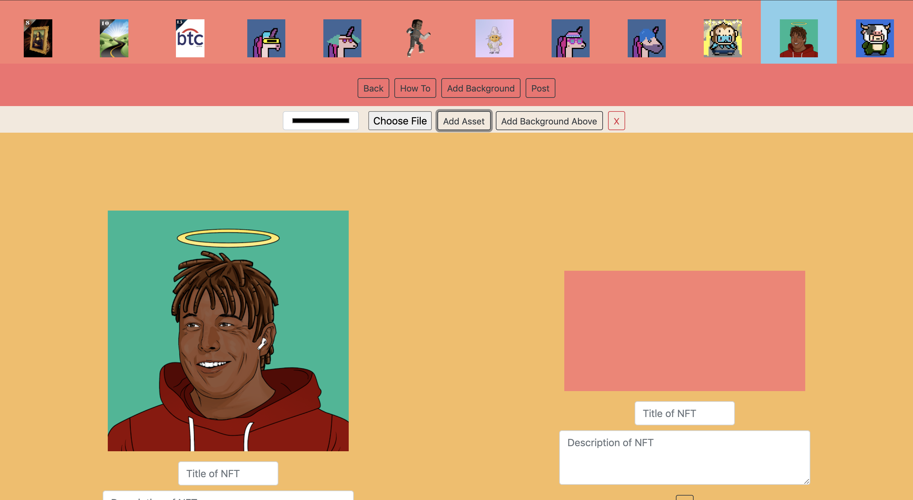
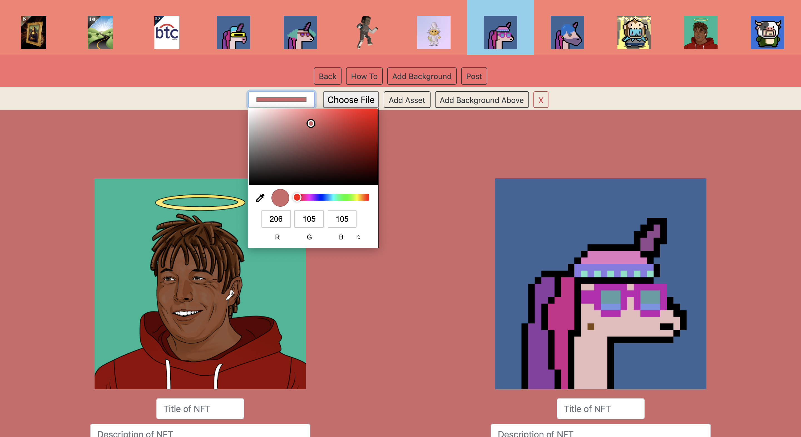
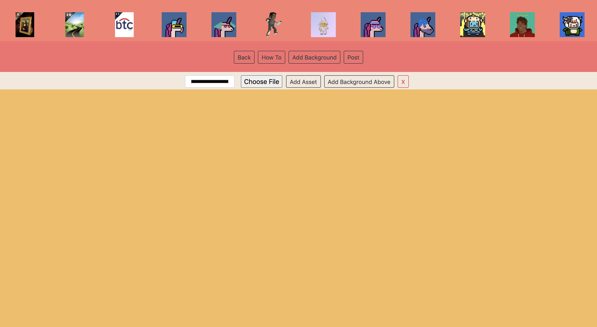

	
	</img>
	 gallery/static/shtfolder/metamask.png

</img>

